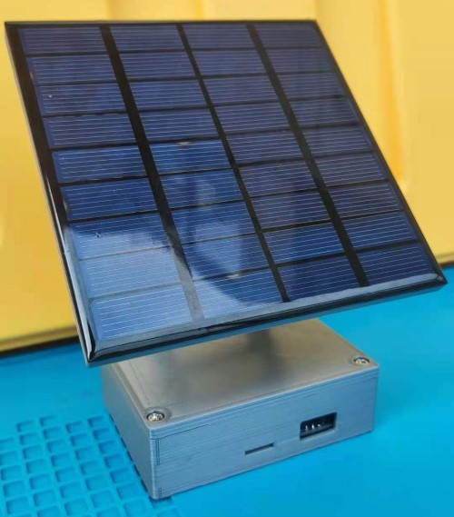

# Friendize_II

需求：光伏行业从业者希望通过一个小产品展示太阳能储能技术；

产品名称：迷你太阳能发电站；

设计理念：令人窒息的100%无边框真全面屏设计；

尺寸：115*115*40mm；

重量：手感真TM好；

防护：IP00；

功能：套娃台灯（用台灯的光发电），充电宝（可充苹果0.4次，安卓0.2次）；

认证：火星认证；

愿景：向日葵设计（加入光感云台可自动朝太阳）；

Customized design for friends.

Repair my maker road and hope it to be a new start.